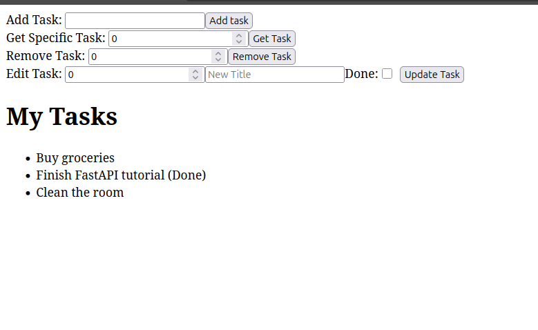
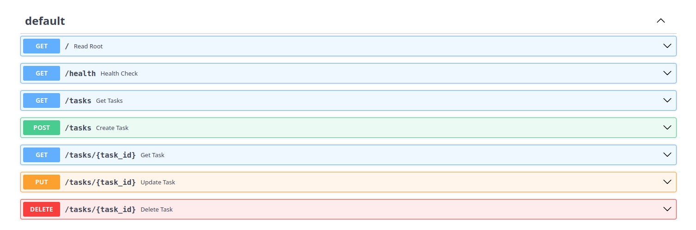
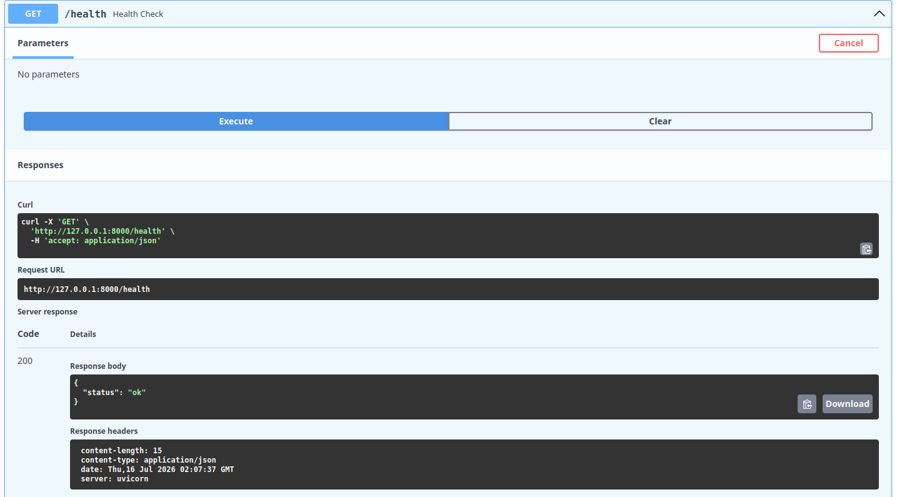
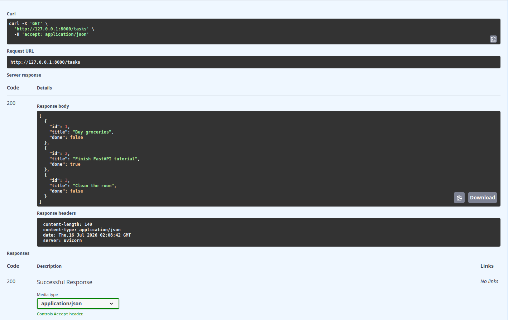
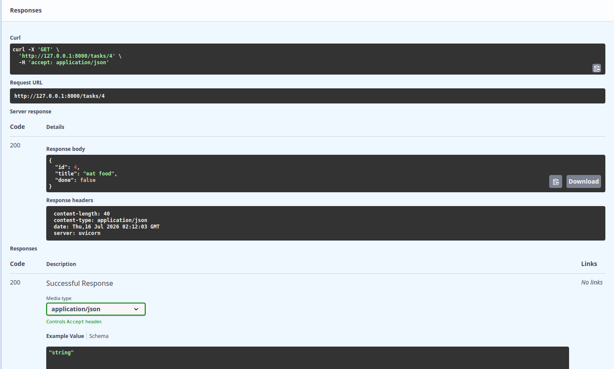
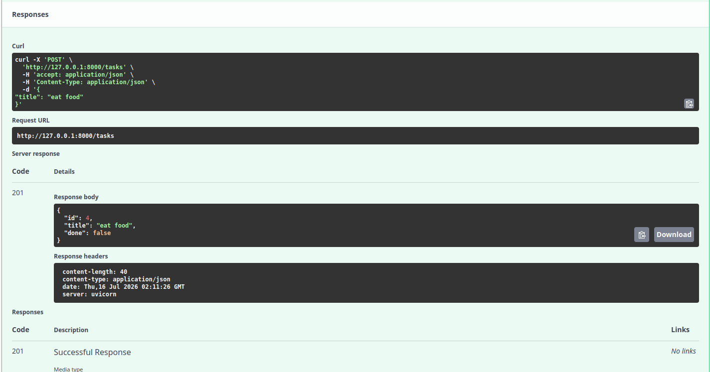
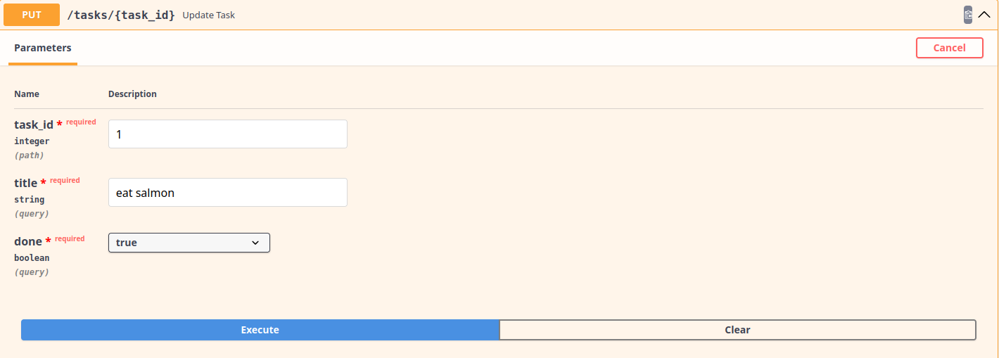
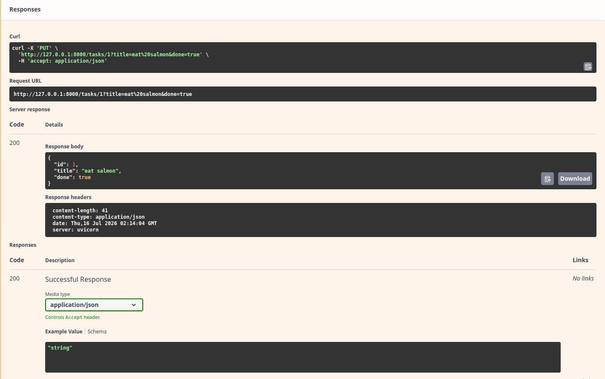
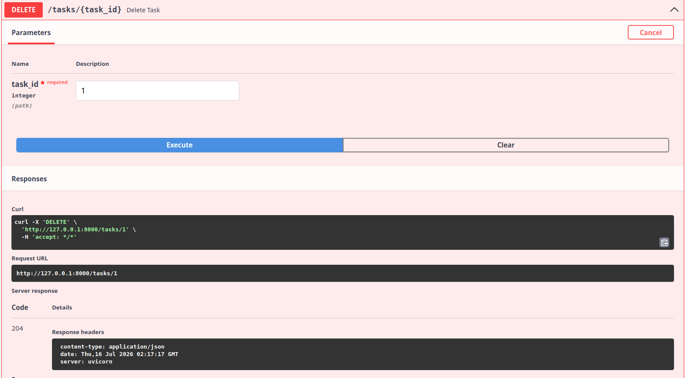

# CRUD with FastAPI

## What This Is
This is a full-stack, containerized application designed to demonstrate a complete modern development workflow. It features a lightweight RESTful API backend built with Python and FastAPI, seamlessly connected to a frontend user interface powered by React and Vite (written in TypeScript). 

The project provides standard CRUD (Create, Read, Update, Delete) functionality to showcase API routing, data validation, CORS configuration, and frontend state management. The entire application is orchestrated using Docker Compose, which provides a consistent, isolated development environment with instant hot-reloading for both the frontend and backend.

---

## How to Install & Run
This project is fully containerized using Docker. You no longer need to install Python or Node.js locally to run it—you only need to have [Docker](https://docs.docker.com/get-docker/) installed on your machine.

To build the images, install dependencies, and launch the development servers, run the following command from the root of your project repository:

```bash
docker compose up --build
```
*Note: This command installs the packages listed in your requirements file and immediately spins up the FastAPI server with hot-reloading enabled. The API will be accessible at `http://127.0.0.1:8000`.*

---

## Endpoints

Below is the routing table for the standard CRUD operations available in this API.

| HTTP Method | Endpoint        | Description                                  |
|-------------|-----------------|----------------------------------------------|
| **GET**     | `/tasks/`       | Retrieve a list of all existing tasks        |
| **GET**     | `/tasks/{id}`   | Fetch the details of a specific item by ID   |
| **POST**    | `/tasks/`       | Create and save a new item                   |
| **PUT**     | `/tasks/{id}`   | Update an existing item entirely via its ID  |
| **DELETE**  | `/tasks/{id}`   | Delete a specific item from the database     |

*(Note: If your main module routes use a different resource name like `/items/`, swap `/tasks/` accordingly.)*

---

## Example Request & Output

Here is an example of what an HTTP response looks like when fetching a single item using the API. 

**Command:**
```bash
curl -i http://127.0.0.1:8000/tasks/1
```

**Output:**
```http
HTTP/1.1 200 OK
date: Thu, 16 Jul 2026 15:29:01 GMT
server: uvicorn
content-length: 53
content-type: application/json

{
  "id": 1,
  "name": "Test Entry",
  "description": "Example data"
}
```

# Screenshots

## Frontend Basic Output


## API Endpoints



---
## Health Check



---

## Get Tasks



---

## Get Task by Id



---

## Create Task



---

## Update Task





---
## Delete Task

