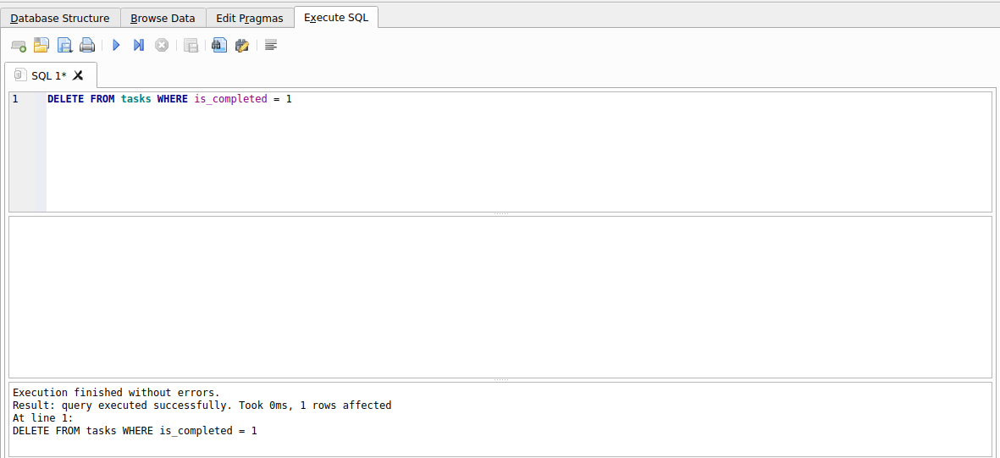

# Week 3 - A2: Task CRUD API

A FastAPI backend for managing tasks (create, read, update, delete), backed by SQLite and containerized with Docker.

## Tech Stack

- **FastAPI** - web framework
- **SQLite** - database
- **Docker Compose** - containerized dev environment

## Why SQLite?

SQLite was chosen for this project because it fits a small CRUD API without any extra infrastructure:

- **Single file** - the entire database is one file (`tasks.db`), no separate database server to install, configure, or connect to.
- **Zero setup** - `sqlite3` support is built into Python's standard library, so there's nothing extra to install or run to get a working database.
- **Survives restarts** - data is written to disk, so tasks persist across API restarts and container rebuilds (as long as the file itself isn't deleted).

## Database File

- The database lives at `backend/tasks.db`.
- It's created automatically on startup by `init_db()` in `backend/app/db/db.py`, which runs the `CREATE TABLE IF NOT EXISTS` statement when the app starts.
- `tasks.db` is git-ignored (see `.gitignore`), so it is **not** committed to the repo - each fresh clone starts with an empty database that gets created the first time the app runs.

## Running the Project

Start everything (build the image and run the API) with a single command from the project root:

```bash
docker compose up --build
```

The API will be available at `http://localhost:8000`, with interactive docs at `http://localhost:8000/docs`.

## Inspecting the Database

You can open `backend/tasks.db` directly with [DB Browser for SQLite](https://sqlitebrowser.org/) to inspect data, browse tables, or run ad-hoc SQL queries.



### Example query (Stage 4)

Deleting every task that had already been marked complete, run from the **Execute SQL** tab:

```sql
DELETE FROM tasks WHERE is_completed = 1;
```
