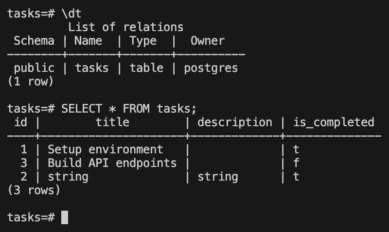

# Week 3 - A3: Containerize Your Stack

A FastAPI backend for managing tasks (create, read, update, delete), backed by Postgres and containerized end-to-end with Docker Compose.

## Tech Stack

- **FastAPI** - web framework
- **Postgres 16** - database
- **psycopg** - Postgres driver
- **Docker Compose** - runs the API and the database together

## Running the Project

Copy the example env file, then start everything (API + Postgres) with a single command from the project root:

```bash
cp .env.example .env
docker compose up --build
```

The API will be available at `http://localhost:8000`, with interactive docs at `http://localhost:8000/docs`.

## Environment Variables

Set variables in `.env` - see `.env.example` for the required keys:

| Variable | Description | Example |
|---|---|---|
| `DATABASE_URL` | Postgres connection string used by the API | `postgres://postgres:dev@db:5432/tasks` |

`docker-compose.yml` already points the `backend` service at the `db` service using this variable, so no extra configuration is needed to run locally.

## Database

- Postgres runs as its own `db` service in `docker-compose.yml`, with data persisted in the `pgdata` volume.
- The `tasks` table is created automatically on startup by `init_db()` in `backend/app/db/db.py`, which runs a `CREATE TABLE IF NOT EXISTS` statement (and seeds a few sample rows on first run).

## Endpoints

| Method | Path | Description |
|---|---|---|
| `GET` | `/` | API info |
| `GET` | `/health` | Health check |
| `GET` | `/tasks/` | List all tasks |
| `GET` | `/tasks/{task_id}` | Get a single task |
| `POST` | `/tasks/` | Create a task |
| `PATCH` | `/tasks/{task_id}` | Update a task |
| `DELETE` | `/tasks/{task_id}` | Delete a task |

### Example request

```bash
curl -i -X POST http://localhost:8000/tasks/ \
  -H "Content-Type: application/json" \
  -d '{"title": "Write README", "description": "Document the API"}'
```

```
HTTP/1.1 201 Created
content-type: application/json

{"id":4,"title":"Write README","description":"Document the API","is_completed":false}
```

## Inspecting the Database

Connect with `psql` (from a separate terminal, while `docker compose up` is running):

```bash
docker compose exec db (should be ur db name) psql -U postgres -d tasks
```

```sql
\dt
SELECT * FROM tasks;
```




